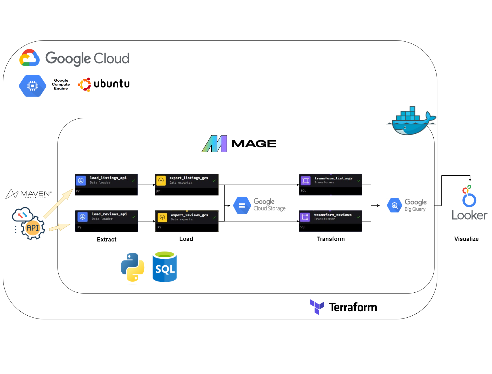

# Data Engineering Zoomcamp Capstone Project
# Airbnb Project

- [Problem description](#problem-description)
- [Data Sources](#data-sources)
- [Data Pipeline](#data-pipeline)
- [Dashboard](#dashboard)
- [Technologies Used](#technologies-used)
- [Reproducibility](#reproducibility)
- [Evaluation Criteria ](#evaluation-criteria)

### Objective

The goal of this project is to apply everything we have learned
in this [Data Engineering Zoomcamp](https://github.com/DataTalksClub/data-engineering-zoomcamp) to build an end-to-end data pipeline.

Also, feel free to browse my work during the camp [here](https://github.com/salmagouda/data-engineering-dilemma).

### Project Demo




## Problem description

As an aspiring data engineer, my task was to design and implement an end-to-end data engineering pipeline and dashboard for managing Airbnb listings and reviews data. The goal is to collect, transform, store, analyze, and visualize data from Airbnb's listings and reviews to provide actionable insights.

Expected Outcomes:

* A robust and scalable data engineering pipeline capable of handling large volumes of Airbnb listings and reviews data.
* Increased efficiency and productivity through automation of data pipeline workflows.
* Actionable insights and visualizations derived from the data to support business decision-making.
* Enhanced understanding of data engineering best practices, tools, and technologies.


## Data Sources


Airbnb data for 250,000+ listings in 10 major cities, including information about hosts, pricing, location, and room type, along with over 5 million historical reviews obtained from [Maven Analytics Data Playground](https://mavenanalytics.io/data-playground?search=airbnb) and ingested through an API for each.


## Data Pipeline 


My pipeline fetches the data from APIs, loads it to Google Cloud Storage, then doing the unnecessary transformations and load it again to Google BigQuery.

All steps are orchestrated in [Mage](https://docs.mage.ai/introduction/overview).

### Data Lake

set using terraform to be used in the pipeline as data storage.


### Data Warehouse

set using terraform to be used in the pipeline for data analytics.


### Pipeline Automation

After setting up my pipline, I made a monthly trigger to run it and collect new data (if exists)


## Dashboard

I used [Google looker studio](https://lookerstudio.google.com/navigation/reporting) to visualize my data.


The dashboard ansewrs those main questions:

* Which citied has the best reviews?
* What are the trends of Guests, Hosts, Lists, and Prices over the years?
* Which cities has more guests?
* What are the preferred room types?
* How does host identity verification affect guest attractions?


## Technologies Used

* **Cloud**: GCP
* **Infrastructure as code (IaC)**: Terraform
* **Containarization**: Docker
* **Workflow orchestration**: Mage
* **Data Lake**: Google Cloud Storage
* **Data Warehouse**: BigQuery
* **Visualization**: Google Looker Studio


## Reproducibility

In order to reproduce the project; please follow along the steps:

### Setting up GCP
Google Cloud is a suite of Cloud Computing services offered by Google that provides various services like compute, storage, networking, and many more. It is organised into Regions and Zones.

Setting up GCP would require a GCP account. A GCP account can be created for free on trial but would still require a credit card to signup.

1. Start by creating a GCP account at [this link](https://cloud.google.com/)
2. Navigate to the GCP Console and create a new project. Give the project an appropriate name and take note of the project ID.
3. Create a service account:

   - In the left sidebar, click on "IAM & Admin" and then click on "Service accounts."

   - Click the "Create service account" button at the top of the page.

   - Enter a name for your service account and a description (optional).

   - Select the roles you want to grant to the service account. For this project, select the BigQuery Admin, Storage Admin and Compute Admin Roles.

   - Click "Create" to create the service account.

   - After you've created the service account, you need to download its private key file. This key file will be used to authenticate requests to GCP services.

   - Click on the service account you just created to view its details.

   - Click on the "Keys" tab and then click the "Add Key" button.

   - Select the "JSON" key type and click "Create" to download the private key file. This key would be used to interact to the google API from Mage.

   - Store the json key as you please, but then copy it into the mage directory of this project  and
give it exactly the name `my-creds.json`.

4. This application communicates with several APIs. Make sure you have enabled the BigQuery API.
- Go to [BigQuery API](https://console.cloud.google.com/apis/library/browse?hl=sv&project=air-quality-project-417718&q=bigquery%20api) and enable it.

---
### Running the Code

*Note: these instructions are used for macOS/Linux/WSL, for Windows it may differ*

1. Clone this repository
2. `cd` into the terraform directory. I am using **terraform** to create google cloud resorces. 
    My resources are created for region **me-west**. If needed, you can change it in **variables.tf** file. In this file you need to change the **project ID** to the project ID you created in GCP.
3. To prepare your working directory for other commands we are using:

```bash
terraform init
```
4. To show changes required by the current configuration you can run:

```bash
terraform plan
```
5. To create or update infrastructure we are using:

```bash
terraform apply
```
6. To destroy previously-created infrastructure we are using:

```bash
terraform destroy
```
**IMPORTANT**: This line uses when you are done with the whole project.

7. `cd` into the mage directory
8. Rename `dev.env` to simply `.env`.

9. Now, let's build the container

```bash
docker compose build
```
10. Finally, start the Docker container:

```bash
docker compose up
```
11. We just initialized a mage repository. It is present in your project under the name `airbnb-data-engineering`. Now, navigate to http://localhost:6789 in your browser! 

This repository should have the following structure:

```
.
├── mage_data
│   └── airbnb_data_engineering
├── airbnb
│   ├── __pycache__
│   ├── charts
│   ├── custom
│   ├── data_exporters
│   ├── data_loaders
│   ├── dbt
│   ├── extensions
│   ├── interactions
│   ├── pipelines
│   ├── scratchpads
│   ├── transformers
│   ├── utils
│   ├── __init__.py
│   ├── io_config.yaml
│   ├── metadata.yaml
│   └── requirements.txt
├── .gitignore
├── .env
├── docker-compose.yml
└── Dockerfile
```

When you are done, in a google bucket you should have two CSV files and in  BigQuery you should have all tables. 

### Creating Visualisations

- With your google account, log in at [Google looker studio](https://lookerstudio.google.com/navigation/reporting)

- Connect your dataset using the Big Query Connector

- Select your project name then select the dataset. This would bring you to the dashboard page

- Create your visualizations and share it .


## Evaluation Criteria 

My self evaluation for the project:

* Problem description
    * 4 points: Problem is well described and it's clear what the problem the project solves
* Cloud
    * 4 points: The project is developed in the cloud and IaC tools are used
* Data ingestion 
    * Batch / Workflow orchestration
        * 4 points: End-to-end pipeline: multiple steps in the DAG, uploading data to data lake
* Data warehouse
    * 4 points: Tables are partitioned and clustered in a way that makes sense for the upstream queries (with explanation)
* Transformations (dbt, spark, etc)
    * 2 points: Simple SQL transformation (no dbt or similar tools) - done using mage 
* Dashboard
    * 4 points: A dashboard with 2 tiles
* Reproducibility
    * 4 points: Instructions are clear, it's easy to run the code, and the code works


