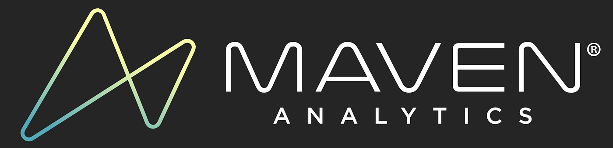
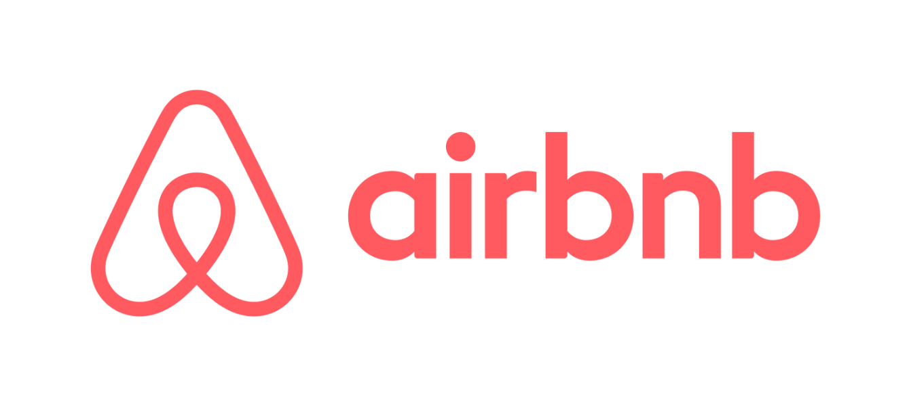

# Data Engineering Zoomcamp Capstone Project
# Airbnb Project

- [Problem description](#problem-description)
- [Data Sources](#data-sources)
- [Technologies Used](#technologies-used)
- [Evaluation Criteria ](#evaluation-criteria)

### Objective

The goal of this project is to apply everything we have learned
in this de zoomcamp to build an end-to-end data pipeline.

## Problem description

As an aspiring data engineer, my task was to design and implement an end-to-end data engineering pipeline and dashboard for managing Airbnb listings and reviews data. The goal is to collect, transform, store, analyze, and visualize data from Airbnb's listings and reviews to provide actionable insights.

## Data Sources

Airbnb data for 250,000+ listings in 10 major cities, including information about hosts, pricing, location, and room type, along with over 5 million historical reviews obtained from [Maven Analytics Data Playground](https://mavenanalytics.io/data-playground?search=airbnb) and ingested through an API for each.

## Data Pipeline 

## Dashboard

## Technologies Used

* **Cloud**: GCP
* **Infrastructure as code (IaC)**: Terraform
* **Containarization**: Docker
* **Workflow orchestration**: Mage
* **Data Lake**: Google Cloud Storage
* **Data Warehouse**: BigQuery
* **Visualization**: Google Looker Studio

## Evaluation Criteria 

My self evaluation for the project.

* Problem description
    * 4 points: Problem is well described and it's clear what the problem the project solves
* Cloud
    * 4 points: The project is developed in the cloud and IaC tools are used
* Data ingestion 
    * Batch / Workflow orchestration
        * 4 points: End-to-end pipeline: multiple steps in the DAG, uploading data to data lake
* Data warehouse
    * 4 points: Tables are partitioned and clustered in a way that makes sense for the upstream queries (with explanation)
* Transformations (dbt, spark, etc)
    * 2 points: Simple SQL transformation (no dbt or similar tools) - done using mage 
* Dashboard
    * 4 points: A dashboard with 2 tiles
* Reproducibility
    * 4 points: Instructions are clear, it's easy to run the code, and the code works

